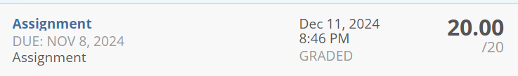

# MATH319 Group Project: Secure Photo Gallery Application
This is a project for MATH319 course. Full information is in [this pdf file](./Math319%20assignment%202024_Semester2.pdf). Our project idea to make a secure photo gallery application using python. Users are able to store their images securly and retrieve them.

# Status: Completed ✅
The application successfully meets all project constraints. We have documented our process in a [report](./report.pdf) and [presented](./presentaion.pdf) our work, and we got full marks for the project.



# Features 
- **User Authentication**: Users can register and log in to securely manage their photos.
- **Photo Upload**: Users can upload images that are automatically encrypted before storage.
- **AES Encryption**: Images are encrypted using the AES cryptosystem to ensure data privacy.
- **Decryption for Viewing**: Users can view their images, which are decrypted on-the-fly when accessed.
- **User Interface**: A simple and intuitive web interface for user interactions.

# Technologies Used
- Python
- Django
- Cryptography (for AES encryption)
- HTML/CSS (for the frontend)

# Skills Gained
Through the development of this project, we gained practical experience in:

- Implementing AES encryption and decryption in Python.
- Utilizing Django for web application development.
- Understanding user authentication and session management.
- Managing file uploads and handling binary data securely.
- Designing a user-friendly interface for web applications.


# Try it Yourself
Ready to explore the project? Follow this guide to clone and run the application on your own machine!


## Requirements

- **Python**: Ensure you have Python installed (version 3.6 or higher).
- **pip**: The package installer for Python should be included with your Python installation.

## Installation Steps

1. **Clone the Project Repository**:
   Begin by cloning the project to your local machine:
   ```bash
   git clone https://github.com/CuzImAzizx/Secure-Photo-Gallery-Application/
   cd Secure-Photo-Gallery-Application
   ```

2. **Install the Dependencies**:
   Use pip to install the required packages:
   ```bash
   pip install -r requirements.txt
   ```

3. **Run Database Migrations**:
   Set up the database by applying migrations:
   ```bash
   python manage.py migrate
   ```

4. **Run the Development Server**:
   Start the Django development server to access the application:
   ```bash
   python manage.py runserver
   ```

5. **Access the Application**:
   Open your web browser and navigate to `http://127.0.0.1:8000/` to start using the app.
